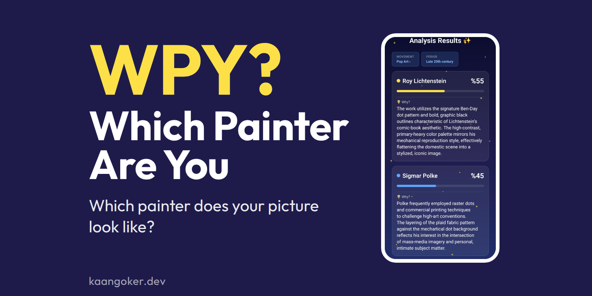
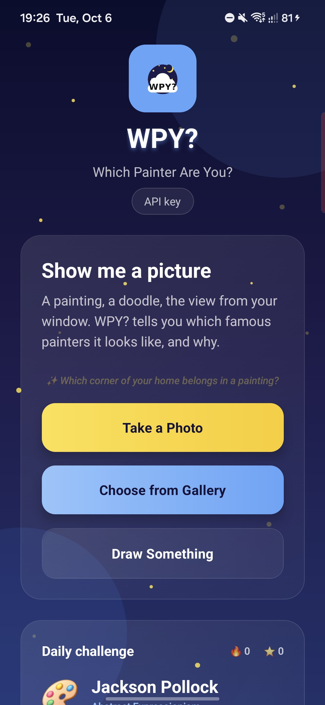
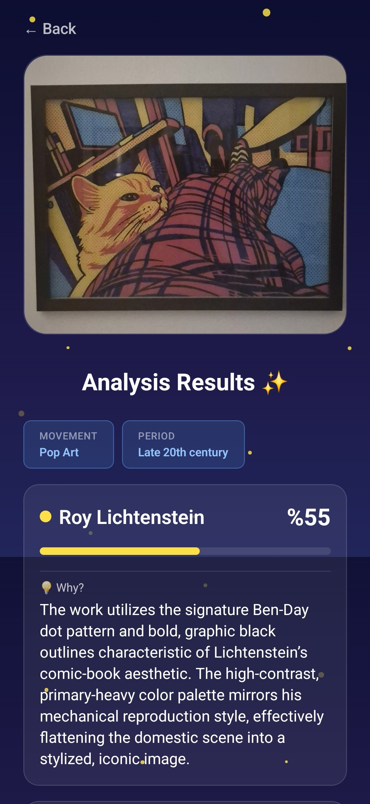
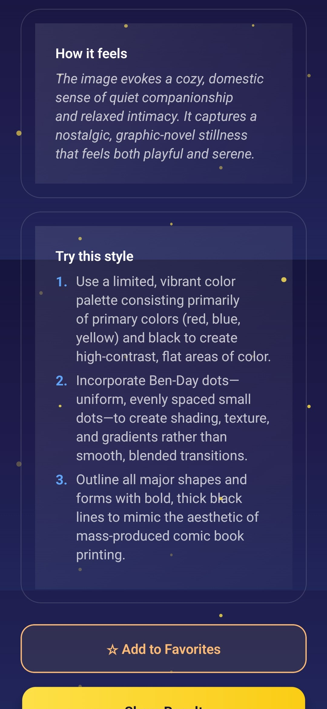
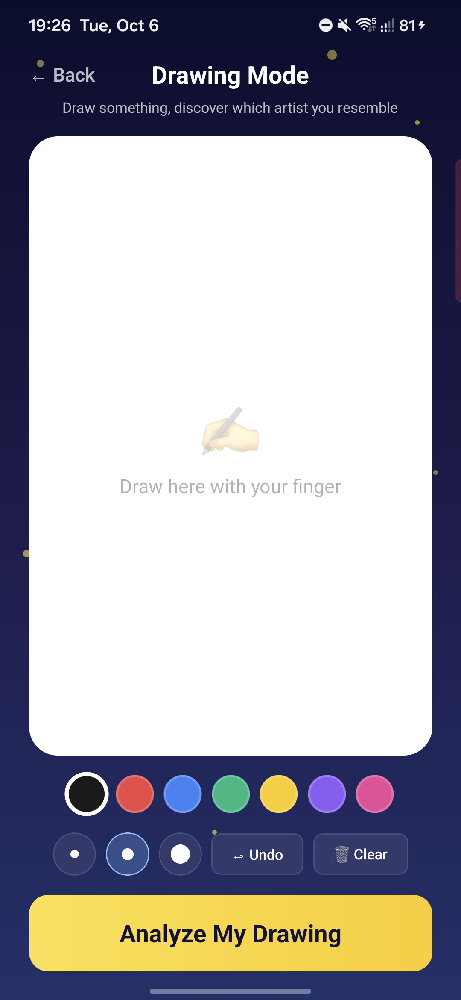

<p align="center">
  
</p>

# WPY? Which Painter Are You

Take a photo of a painting, a sketch or just your living room, and see which famous painters it looks like.

WPY? is a small mobile app I built to play with vision models. You give it a picture and Gemini compares it with the great painters: it picks the three to five closest matches, gives each one a percentage, and says what it noticed, for example the brushwork or the palette. Then you can open each painter's best known work and read more about them. There is no server and no account. The app runs on your own free Gemini API key.

> **Status:** a personal hobby and development project. It is not a product, it is not maintained as a service, and it comes with no guarantees. Please read the [Disclaimer](#disclaimer) before you install it.

<p align="center">
  
  
  
  
</p>

## Download

Get the Android APK from the [latest release](https://github.com/KaanGoker/which-painter-are-you/releases/latest). It is built for 64-bit ARM phones, which covers almost every Android phone from the last few years. You may need to allow "install unknown apps" for your browser or file manager.

On first launch the app asks for a Gemini API key. You can make one for free at [aistudio.google.com/apikey](https://aistudio.google.com/apikey).

## Features

- **Painter matches with reasons.** Take a photo or pick one from your gallery. You get the painters your picture is closest to, each with a percentage and a sentence or two about what the model noticed.
- **Draw and analyze.** Sketch something with your finger on the built-in canvas and run the same analysis on it.
- **Daily challenge.** Every day one painter's style is the target. Find something that matches it and keep your streak going.
- **Real artwork.** Each match links to the painter's iconic work (public domain, from Wikimedia Commons) and a short Wikipedia summary.
- **How it feels, and how to try it.** A second request adds the mood of your picture and a few concrete tips for making something in that painter's style.
- **History, favorites and share cards.** Past results stay on your phone, you can pin the ones you like, and any result can be shared as an image.
- **Your own key.** You paste your Gemini key once. It is kept in the phone's secure storage (Android Keystore, iOS Keychain) and only goes to Google with your requests.

## How it works

The interesting part is the prompt. Instead of a plain "which artist is this", the model goes through four steps: decide what the picture is (artwork, composed photo, or neither), look at composition, color, texture, subject and period, score each candidate painter on five points, then scale the totals to 100. A selfie or a screenshot gets a friendly "this does not look like art" instead of a confident wrong answer.

The result screen reads the model's JSON and animates the bars. The mood and tips call starts only after the main answer is on screen, so it does not slow the result down. When Gemini is busy (503) or you hit a rate limit (429), the app retries quietly a few times.

- **Stack:** React Native 0.81, Expo SDK 54, React Navigation
- **Model:** `gemini-3.1-flash-lite`, called straight from the phone with your key
- **Storage:** expo-secure-store for the key, AsyncStorage for history, favorites and the streak
- **Look:** a night sky theme based on the app icon, with glass cards and a few twinkling stars

## Project structure

```
.
├── App.js                      # navigation, first launch goes to the key screen
├── assets/                     # app icon, adaptive icon, splash
├── docs/                       # cover and screenshots
└── src/
    ├── screens/                # ApiKey, Home, Result, Draw
    ├── components/             # ArtistCard, ArtistProfileModal, ShareCard, StarField, ...
    ├── services/               # artAnalysis, apiKeyService, history, favorites, challenge, wikipedia
    ├── data/                   # painter to iconic painting map
    └── constants/              # theme and all user-facing text
```

## Build it yourself

You need Node 20 or newer, and either the Expo Go app or the Android SDK.

```bash
npm install
npx expo start
```

Scan the QR code with Expo Go. To build your own APK:

```bash
npx expo prebuild --platform android
cd android && ./gradlew assembleRelease
```

## Disclaimer

WPY? is a hobby project made for learning and development. By installing or using it you accept the points below.

- **No warranty.** The app and the code are provided "as is", without any warranty, as stated in the [MIT License](LICENSE). I am not liable for any damage, data loss, costs or other problems that come from using it.
- **Not an expert opinion.** The matches, percentages and texts are generated by an AI model. They can be wrong, made up or inconsistent between runs. They are not an art historical assessment, an attribution, an authentication or a valuation of any artwork, and should not be used as one.
- **Your key, your account.** The app uses the Gemini API key you enter. All usage, quota and any charges on that key fall under your own agreement with Google and the [Gemini API Terms](https://ai.google.dev/gemini-api/terms), which also set the minimum age (18 and over).
- **Where your pictures go.** Pictures you analyze are sent from your phone directly to Google's Gemini API. I do not run a server and I do not receive, store or see your pictures, results or key. On Google's free tier, Google may use what you send to improve its products and human reviewers may read it, except in the EEA, Switzerland and the UK, where the paid-tier terms apply. See Google's terms for details.
- **Be careful with what you upload.** Do not analyze pictures that contain other people, personal or sensitive information, or images you do not have the right to use.
- **Stored on your phone.** Your history, favorites and challenge streak are kept only on your device. Uninstalling the app deletes them. Opening a painter's profile loads a summary and an image from Wikipedia and Wikimedia Commons.
- **No affiliation.** WPY? is not affiliated with, endorsed by or sponsored by Google, Wikipedia, Wikimedia, or any artist, estate or museum. Painter names are used only to identify their style. The artwork images shown in the app are in the public domain.
- **No support promised.** The project may change or stop at any time. Issues and pull requests are welcome, but there is no promise of a reply or a fix.

## License

MIT. See [LICENSE](LICENSE).
